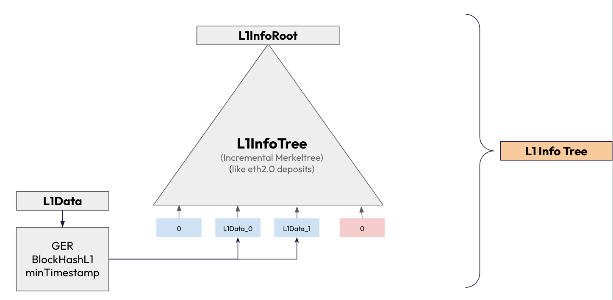

# L1 Info Tree

## Summary from etrog slide deck

Link: https://docs.google.com/presentation/d/1QvmaCwDIpCeMlU-KkOfCEVtekuKP7_GJEJJ2wSY9syU/edit#slide=id.g282f6c192a8_1_34
 
- Data structure present in the Smart Contracts to allow:
  - Granularity in GlobalExitRoot during batch processing
  - Add L1 information to L2

- Information included in the L1 Info Tree
  - GlobalExitRoot
  - L1 block hash
  - minTimestamp

- L1InfoTree has 32 static levels
- Incremental
  - Add new leaf when a new GER is computed in the SC
- Given an index → could always get (verify) a L1Data
  - If an index does not still contain any L1Data → L1Data = 0
- Only save the latest l1InfoRoot in the SC
- Index 0 has GER = 0 (Special index)
  - Allow not changing GER with index = 0
  - Less gas cost data-availability

## Special cases
From a code/node perspective there are two effective L1 info roots that point to the 0 index.  A special hardcoded empty tree root of 0x27AE5BA08D7291C96C8CBDDCC148BF48A6D68C7974B94356F53754EF6171D757` which will always point to the 0 index, and the first actual L1 info tree update event on the network is also considered index 0.

This is used for the purpose of knowing when to write to the GER manager (we only do this for index > 0, but do not write the special hash above to the contract).

## Sequencer concerns

When building batches the sequencer is responsible for tracking the L1 info tree and storing information about the indexes, and tracking which indexes have already been used during block creation.

The index is known by simply tracking the events from the GER manager contract on the L1 from the start of the network and incrementing by 1 each time a new event is found.  Index 0 is a special index and is used to denote no change.  The hash for index 0 will remain the same across all networks as it is simply an empty tree.

At the point of building a new block the sequencer will check to see if the next index is available to use:

- Current index + 1 exists in DB? (this means that the block has been finalised on the L1 and we can proceed to check if we can use this or not)
  - if yes check: minTimestamp on L1 info tree update <= current block timestamp
    - if yes: use this index
    - if no: stop the search here, we cannot use any further index so we will use index 0 to denote no change

If this condition is met then we can use this index for this block.  This check is performed at the start of each block creation.

***info***: If there is a large enough gap between the proposed block timestamp and the new minTimestamp value of the L1 info tree update that indicates that the L2 has fallen behind.  Here a decision needs to be made about catching up the L2 to the L1 by either producing many empty blocks or creating a single block with a large delta.

## L1 recovery concerns

During L1 recovery we need to check for invalid batches at the point of de-serialising the L1 data.

The checks largely involve the L1 info tree:

- Does the L1 info tree have the index specified in the changeL2Block transaction?
- Is the previous block timestamp + delta from changeL2Block transaction >= minTimestamp in L1 info tree update for this block?
- Is the previous block timestamp + delta from changeL2Block transaction <= limitTimestamp
- Was the index used in existance at the time?

If any of these conditions are met then the batch is invalid and should be discarded during L1 recovery.